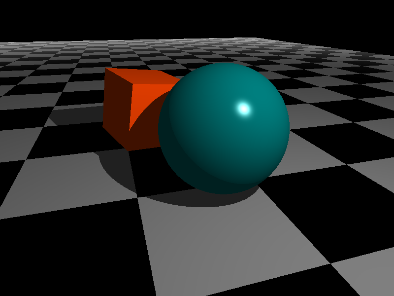
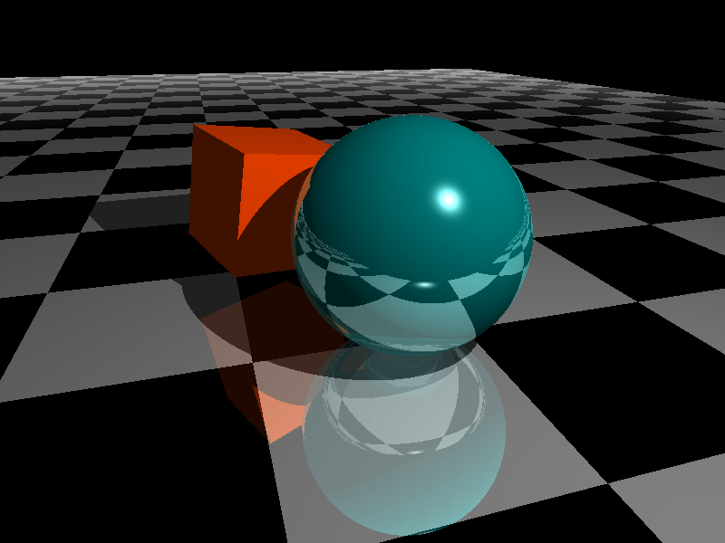
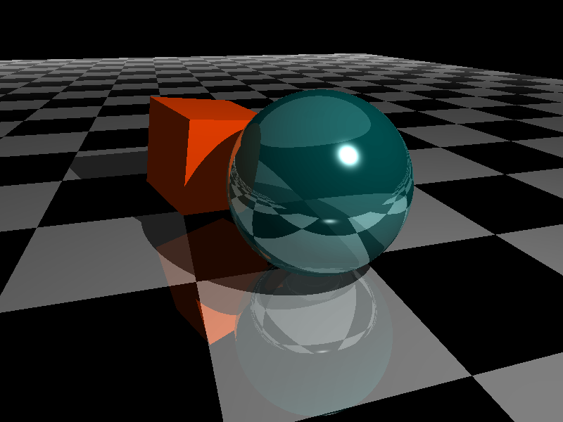
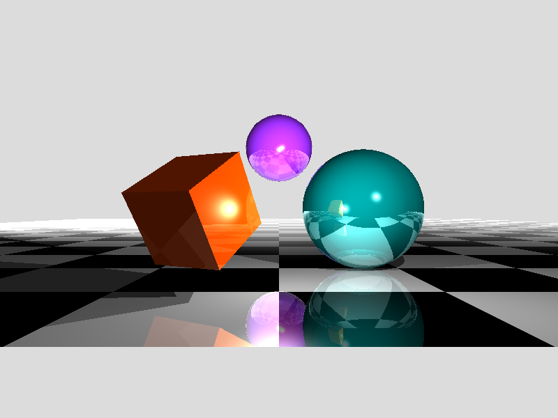
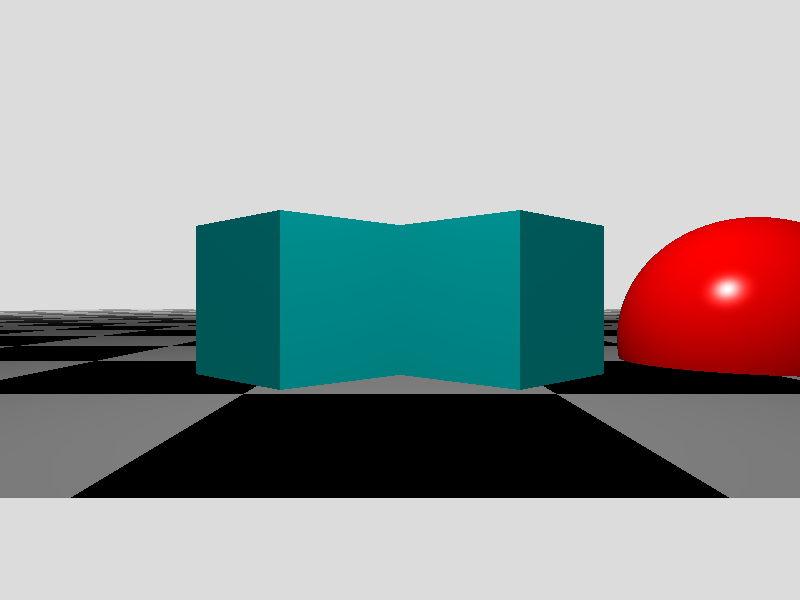
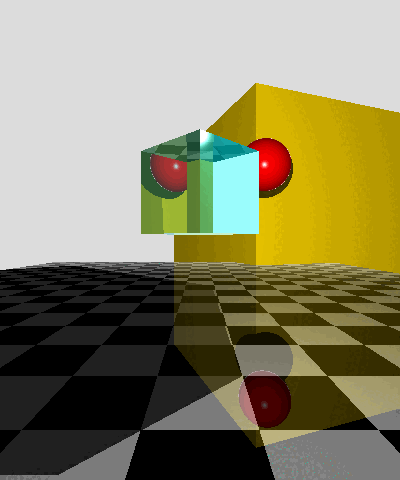

# Projet RayTracer

## Introduction

Bienvenue sur ce dépôt, ceci représente mon projet de fin de **DEC** en informatique.

Il s'agit d'un **ray-tracer**, un programme qui est capable de générer une **image de synthèse**, à partir **d'une description de scène**, en se basant sur le principe du **Ray Casting**. Cette technique de rendu, consiste à suivre le déplacement inverse de la lumière pour déterminer l'illumination pour chaque point de la scène 3D.

Ce projet s'étale sur 8 semaines, pendant lesquelles je devais proposer, et implémenter des fonctionnalités pour le moteur de rendu, essentiellement.

## Contraintes

Les contraintes pour ce projet étaient :

* d'utiliser des technologies qui n'avaient pas été présentées au cours des 3 années d'études.

* de faire en sorte que les fonctionnalités demandées soient fonctionnelles

* d'utiliser la **méthode Agile** (2 sprints de 4 semaines)

* produire de la **documentation** ainsi que des **prototypes** pour limiter les risques du projet.

* d'utiliser des **patrons de conception** ainsi que les principe **SOLID** afin de faciliter la maintenance de l'application ainsi que l'ajout de fonctionnalités

## Mon projet

J'ai choisi le langage [Python](https://www.python.org/) pour créer mon application de ray-tracing, pour élargir mes connaissances en terme de langage de programmation. Pour ce projet j'ai pensé que Python serait un bon choix pour les raisons suivantes :

* **rapidité de développement** : grâce aux nombreuses librairies disponibles, il est possible de créer des applications avec un plus haut niveau d'abstraction.

* langage utilisé dans le domaine de **l'éducation et scientifique** : convient aux applications à fortes composante mathématiques

* langage **très répandu** et portable : il est important de se familiariser avec des langages très répandus 

 

---

 

## Résultats

### **Rendus**

Les rendus mettent en valeur les fonctionnalités du ray-tracer :

* Phong Shading (illumination de base) 

    

---

 

* Surfaces réflectives :

    

---

 

* Transparence :

    

 

* Transparence et Réfraction :

    

---

 

* Support de multiples sources d'éclairage (Point light)

    

---

 

* Occlusion ambiante :
    
    

    
    

    

---

 

### Animation
Voici une petite animation créée en assemblant plusieurs rendus, elle permet d'assimiler plus facilement la réfraction dans un cube :

Pour accédez à davantage de **rendus**, suivre ce **[lien](./rendus/)**

en ce qui concerne les fichier de descriptions de scènes, cliquez **[ici](./raytracer/scene_samples/)**

 

---

 

### **Conclusion**

Ce projet a été très intéressant car il m'a permis : 

* de me familiariser avec le langage Python, et de comprendre comment l'utiliser dans le cadre de la programmation objet. 

* de mettre en pratique les connaissances acquises lors du DEC en informatique

* de me familiariser avec le "Pipeline graphique", ou encore la chaîne de traitement nécessaire pour créer une image.

* de comprendre la manipulation de vecteur dans un espace tri-dimensionnel 

* de rafraîchir mes connaissances en mathématiques et d'en acquérir de nouvelles 